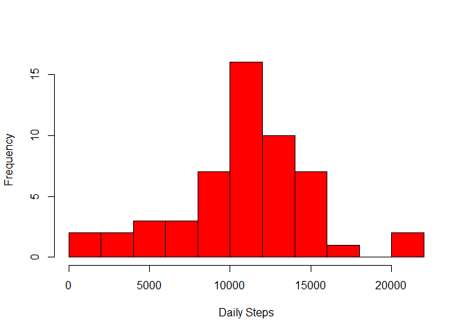
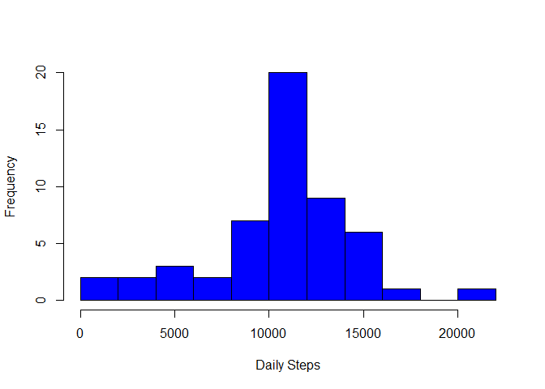
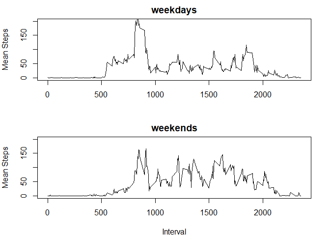

## Loading and preprocessing the data
To begin the data must be downloaded in to the working directory.

```r
download.file("https://d396qusza40orc.cloudfront.net/repdata%2Fdata%2Factivity.zip", 
              destfile = "data.zip")
unzip("data.zip")
```
The data was saved as activity.csv. The following code will then store the data into a data frame.

```r
actData <- read.csv("activity.csv", header = TRUE, 
                    colClasses = c("integer", "Date", "integer"))
```

## Mean and median steps
Since the the data contains missing values, they will be ignored for now.

```r
noNa <- na.omit(actData)
```
### Daily steps
A vector of daily steps can be created with the following code.

```r
daily <- integer()
dailyList <- split(noNa, noNa$date)
## Iterate over each day and put the sum of steps into daily vector
for(i in 1:53) {
    daily[i] <- sum(data.frame(dailyList[i])[, 1])
}
```
Plotting the daily steps yields the following histogram:

```r
hist(daily, xlab = "Daily Steps", main = "", col = "red", breaks = 10)
```

<!-- -->

The mean and median steps are calculated and displayed.

```r
mn <- mean(daily)
md <- median(daily)
mm <- c(Mean = mn, Median = md)
print(mm, type = "html")
```

```
##     Mean   Median 
## 10766.19 10765.00
```

## Average daily activity patterns
A data frame for average step for each interval is made as followed.

```r
dInterval <- aggregate(noNa$steps, by = list(noNa$interval), mean)
```
A time series plot of these is generated:

```r
plot(dInterval, type = "l", xlab = "Interval", ylab = "Mean Steps")
```

<!-- -->

  The interval with the maximum number of steps is shown.

```r
for(i in 1:length(dInterval[, 2])){
    if(dInterval[i, 2] == max(dInterval[, 2])) {
        maxInterval <- dInterval[i,1]}
}
maxInterval
```

```
## [1] 835
```

## Imputing missing values
Number of missing values in the data.

```r
sum(is.na(actData[, 1]))
```

```
## [1] 2304
```
The following replaces the NA values with the mean of the that interval.

```r
actDataNew <- data.frame()
l <- length(actData[, 1])
ld <- length(dInterval[, 2])
for(i in 1:l) {
    if(is.na(actData[i, 1])) {
        temp <- i %% ld
        if(temp == 0) {temp <- 1}
        actDataNew[i, 1] <- dInterval[temp, 2] 
    }
    else {
        actDataNew[i, 1] <- actData[i, 1]
    }
    actDataNew[i, 2:3] <- actData[i, 2:3]
}
```
A histogram of the filled-in data can now be created and the new mean and median can be calculated.

```r
daily2 <- integer()
daily2List <- split(actDataNew, actDataNew$date)
## Iterate over each day and put the sum of steps into new daily vector
for(i in 1:53) {
    daily2[i] <- sum(data.frame(daily2List[i])[, 1])
}
hist(daily2, xlab = "Daily Steps", main = "", col = "blue", breaks = 10)
```

<!-- -->

```r
##Mean and median
mn2 <- mean(daily2)
md2 <- median(daily2)
mm2 <- c(Mean = mn2, Median = md2)
print(mm2, type = "html")
```

```
##     Mean   Median 
## 10498.71 10766.83
```
The filled in data has a slight impact on the average values. The values are 
calculated from the first to the second calculation

```r
differences <- c(MeanDif = mn - mn2, MedianDif = md - md2)
differences
```

```
##    MeanDif  MedianDif 
## 267.475258  -1.830189
```

## Differences in activity patterns between weekdays and weekends
A factor variable differentiating the weekdays from the weekends is added to the
data frame.

```r
y <- factor(c("weekday", "weekend"))
z <- character()
for(i in 1:l) {
    z[i] <- weekdays(actDataNew[i,2])
    if(z[i] == "Monday" || z[i] == "Tuesday" || z[i] == "Wednesday" ||
       z[i] == "Thursday" || z[i] == "Friday") {
        y[i] <- "weekday"   
    }
    else {y[i] <- "weekend"}
}
actDataNew <- cbind(actDataNew, y)    
```
Now the data can be separated and plotted based on weekdays and weekends.

```r
weekdayList <- split(actDataNew,actDataNew$y)
weekdayData <- data.frame(weekdayList[1])
dIntervalDay <- aggregate(weekdayData$weekday.V1, 
                          by = list(weekdayData$weekday.interval), mean)
weekendData <- data.frame(weekdayList[2])
dIntervalEnd <- aggregate(weekendData$weekend.V1, 
                          by = list(weekendData$weekend.interval), mean)

par(mfrow = c(2, 1), mar = c(4, 4, 2, 2))
plot(dIntervalDay, type = "l", xlab = "", ylab = "Mean Steps",
     main = "weekdays", ylim = c(0, 200))
plot(dIntervalEnd, type = "l", xlab = "Interval", ylab = "Mean Steps",
     main = "weekends", ylim = c(0, 200))
```

<!-- -->
  
  
  The above the average steps taken throughout the day do vary quite a bit on 
weeks vs.weekends  


